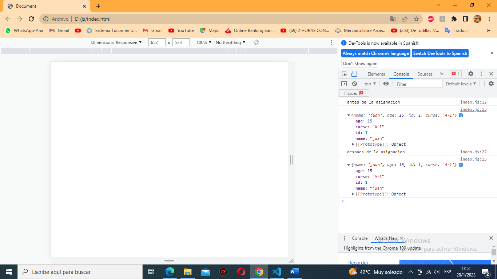

# POO un poco más profundo con Js
Hablemos de POO (Programación orientada a objetos) desde un puto de vista un poco diferente.
Cada objeto tiene ciertas propiedades o métodos que heredan de la super clase Object. Algunos métodos estáticos muy conocidos son Key(), Entries(), Value().
Pero hay otros métodos un poco menos conocidos que tienen su utilidad. Hablemos del método getOwnPropertyDescriptors(). Este método nos devuelve una serie de propiedades que no son muy conocidas.
Creemos un archivo y lo pongamos a prueba. En el archivo coloquemos el siguiente código y abrámoslo en nuestro navegador.

    const estudiante = {
        name : 'juan',
        age: 15,
        id: 1,
        curse: 'A-1'
    }

    console.log(Object.getOwnPropertyDescriptors(estudiante))

notaremos que el objeto nos devuelve ciertas propiedades que están por defecto inicializadas en true.

### ¿Qué son estas propiedades?
Estas propiedades son las que nos permiten acceder a cada uno de nuestros atributos.
- Configurable: Esta indica si la propiedad puede ser borrada o eliminada.
- Enumerable: Indica si la propiedad puede ser mostrada en la enumeración de las mismas. Existen ciertos métodos que toman como referencia este valor para mostrar la propiedad.
- Writable: Esta indica si la propiedad puede ser modificada con el operador de asignación.

Pongamos a prueba si lo que digo es verdad o no.

    estudiante.name = 'Juan'
    console.log('antes de la asignacion')
    console.log(estudiante)

    Object.defineProperty(estudiante, "name", {
        value: estudiante.name,
        writable: false,
        enumerable: true,
        configurable: true
    })
    estudiante.name = 'Ana'
    console.log('despues de la asignacion')
    console.log(estudiante)

Vemos aquí que a pesar de asignarle un nuevo nombre a juan este no nos permitió cambiar el valor del atributo name. Veamos los otros ejemplos

    console.log('antes de la invocarlo')
    console.log(estudiante)
    console.log(Object.keys(estudiante))
    Object.defineProperty(estudiante, "name", {
        value: estudiante.name,
    writable: true,
        enumerable: false,
        configurable: true
    })

    console.log('despues de la despues')
    console.log(Object.keys(estudiante))
    console.log(estudiante)

Con el segundo caso notamos que aunque nos aparece en la consola con menos opacidad al usar otros métodos como el keys() no aparece.

    console.log('antes de la intentar borrarlo')
    delete estudiante.age
    console.log(estudiante)

    Object.defineProperty(estudiante, "name", {
        value: estudiante.name,
        writable: true,
        enumerable: true,
        configurable: false
    })

    console.log('despues de la intentar borrarlo')
    delete estudiante.name
    console.log(estudiante)

En el ultimo caso vemos que aunque pudimos borrar otro atribulo, después de poner la propiedad configurable en false no nos permito borrar el atribulo asignado.

Claro que esto puede ser muy engorroso tener que acceder atributo por atributo, por suerte Js tiene 2 propiedades que nos facilita el encapsulamiento.

	Object.freeze()

Este método congela un objeto que sea pasado. Es decir:

- Impide que se le agreguen nuevas propiedades
- Impide que sean eliminas propiedades ya existentes
- Impide que sus las propiedades internas (writable, enumerable y configurable) sean modificadas

	 Object.seal()

Este método sella un objeto que sea pasada. Es decir:

- Impide que los atributos del objeto sean modificados.
- Cambia en todas las propiedades configurable: false, con lo que impide que sean borradas.

## copia de un objeto

Como sabemos en Js los objetos son una referencia o un puntero a un espacio en memoria. Cuando nosotros copiamos este objeto nosotros en realidad estamos asignándole el puntero que tiene ese objeto.
Que inconveniente puede traernos esto. Veámoslo con un ejemplo.

	const estudiante2 = Object.assign({},estudiante)
	const estudiante3 = Object.create(estudiante)

	estudiante2.name = 'Ana'
	estudiante3.name = 'pedro'
	estudiante.curse.name = 'Js'

	console.log("original");
	console.log(estudiante);
	console.log("copias");
	console.log(estudiante2);
	console.log(estudiante3);

Cuando nosotros copiamos el objeto estudiante a nuestro nuevo objeto estudiante 2 y intentamos cambiarle el ñame, vimos que no solo se cambio el name de estudiante2 sino también de mi objeto original. Eso es debido a que nosotros acedemos al mismo puntero con dos variables distintas.
Para no dar vuelta entre tantas complicaciones y posibles soluciones te traigo dos posibles soluciones que solo servirán en casos específicos.
La primera solución son con dos funciones Object.assign() y Object.create(), ambos van a crear una copia del objeto en un espacio de memoria diferente.
Sin embargo, dos métodos se ven limitados cuando dentro de un mismo objeto se encuentra otro objeto.

Vemos que a pesar de que creo una copia, no pudo asignar una nueva copia a el objeto que estaba dentro de este objeto. Entonces ¿Cómo podemos solucionar este problema?
La segunda opción nos da la respuesta y eso es haciendo uso de json.Parse y json.stringify.

	const str = JSON.stringify(estudiante)
	const estudiante2 = JSON.parse(str);

	estudiante2.name = 'Ana'
	estudiante2.curse.name = 'Js'

	console.log("original");
	console.log(estudiante);
	console.log("copia");
	console.log(estudiante2);

Pero ¿qué pasaría si ese objeto tuviese un método? Bueno desde ya te anticipo que dicho método no se copiara en nuestro nuevo objeto ¿Como podemos entonces solucionar este problema? Haciendo uso de la recursividad.

## Recursividad

Recursividad es una técnica de programación que consiste en que una función se llama a sí misma y crea una nueva ejecución de nuestra función.

	var numero =0;

	function funcionRecursiva(numero){
		console.log(numero);
		if(numero < 5){
			return funcionRecursiva(numero + 1);
		}else {
			return 5;
		}
	}

	funcionRecursiva(numero);

Como puedes ver, este ejemplo puede imprimir los números del 0 al 5. Una solución que habría costado menos con una simple iteración. Entonces ¿Cuándo usar la recursividad?
La respuesta es simple, cuando no exista una solución iterable simple.
Como uso la recursividad para copiar un objeto con sus métodos, con el siguiente código.

    function isObject(subject) { 
        return typeof subject == "object"
    }
    function esUnArray(subject) {
        return Array.isArray(subject);
    }

    function deepCopy(subject) {
        let copySubject;
        const subjectIsArray = esUnArray(subject);
        const subjectIsObject = isObject(subject);

    if(subjectIsArray) {
            copySubject = [];
        } else if(subjectIsObject) {
            copySubject = {};
        } else {
            return subject;
        }
    for(key in subject) {
        const keyIsObject = isObject(subject[key]);
        
        if(keyIsObject) {
            copySubject[key] = deepCopy(subject[key]);
        
        } else {
            if(subjectIsArray) {
                copySubject.push(subject[key]);
            } else {
                copySubject[key] = subject[key]
            }
        }
    }
            
    return copySubject;
	} 

Lo primero que hacemos es crear una función que valide si lo que estamos ingresando es un objeto. Lo mismo hacemos con los arrays.
Esto nos va a permitir copiar objetos y array dentro de nuestro objeto. Luego dentro de nuestra función deepCopy invocamos estas dos funciones.
Con esto puedo instanciar una nueva variable, como un array o objeto vacio y en el caso de no ser ninguna de las dos. Simplemente devuelvo el objeto tal como es.
Luego en un blucle forIn (en el caso de ser un array o un objeto) veo si cada elemento que estoy iterando es un objeto, para todo lo demás lo voy agregando en cada ciclo.

Seamos un poco mas practico ahora y creemos una función que cree estudiantes. Como ya sabran, en nuestros objetos puede haber campos requeridos o no ¿Cómo hacemos esto con Js? Se puede hacer a través de RORO

>**RORO **= Recibir un Objecto, y Retornamos otro Objecto. Dentro de una función, recibimos un solo parámetro que es un objecto, el cual internamente contiene varias propiedades, con las cuales retornara otro nuevo objeto.

    function requiredParam(param){
        throw new Error(param + " Campo obligatorio");
    }

    function createStudent({
        name = requiredParam("name"),
        email = requiredParam("email"),
        age,
        twitter,
        instagram,
        facebook,
        approvedCourses = [],
        learningPaths = [],
    } = {}) {
        return {
            name,
            age,
            email,
            approvedCourses,
            learningPaths,
            socialMedia: {
                twitter,
                instagram,
                facebook,
            },
        };
    }

    const carlos = createStudent({
        name: 'Carlito',
        age: 20,
        email: 'carlito@mazzarolito.com',
        twitter: 'carlitosmzz',
    });

Lo que hicimos fue crear una nueva función que validara si los campos estaban vacíos. Luego lo inicializamos en nuestro campo que queríamos que fueran obligatorios llenarlos.
Como puedes ver, al final de los parámetros vemos que nuestro objeto esta instanciado con un objeto vacío. Esto es para decirle al intérprete de Js que por defecto este es un objeto vacío.

Ahora nos vemos en la necesidad de evitar que nuestras otros invadan y creen nuevas instancias desde la consola del navegador y cómo podemos hacer esto. ¿Cómo evitamos esta? Con el operador **instanceof** verifica si un objeto en su cadena de prototipos contiene la propiedad prototype de un constructor.
Modifiquemos ligeramente nuestro código

    function LearningPath({
        name = requiredParam("name"),
        courses = [],
    }) {
        this.name = name;
        this.courses = courses;
    }

    function Student({
        name = requiredParam("name"),
        email = requiredParam("email"),
        age,
        twitter,
        instagram,
        facebook,
        approvedCourses = [],
        learningPaths = [],
    } = {}) {
        this.name = name;
        this.email = email;
        this.age = age;
        this.approvedCourses = approvedCourses;
        this.socialMedia = {
            twitter,
            instagram,
            facebook,
        };

        if (isArray(learningPaths)) {
            this.learningPaths = [];

            for (learningPathIndex in learningPaths) {
                if (learningPaths[learningPathIndex] instanceof LearningPath) {
                    this.learningPaths.push(learningPaths[learningPathIndex]);
                }
            }
        }
    }

    const escuelaWeb = new LearningPath({ name: "Escuela de WebDev" });
    const escuelaData = new LearningPath({ name: "Escuela de Data Science" });
    const carlos = new Student({
        name: 'Carlito',
        email: 'carlito@mazzarolito.com',
        twitter: 'carlitosmzz',
        learningPaths: [
            escuelaWeb,
            escuelaData,
            {
                name: "impostor",
                courses: "tambien impostor"
            }
        ],
    });

    console.log(carlos)

Como puedes ver cree una nueva función constructora de LearningPath, que verificara que el por lo menos tenga un nombre.
Luego instancie los parámetros que vienen dentro de esta función y verifique, primero que lo que entra sea un array y luego que allá sido creada con mi función constructora.

El resultado final, ahora personas mal intencionadas no pueden crear nuevas instancias de LearningPath. Sin embargo, nuestras instancias no están completamente protegidas, para evitar que sobrescriban en ella también tememos que encapsularas para que solo puedan ser modificadas dentro del archivo donde fue creado.
Modifiquemos una vez mas nuestro código

    function Student({
        name = requiredParam("name"),
        email = requiredParam("email"),
        age,
        twitter,
        instagram,
        facebook,
        approvedCourses = [],
        learningPaths = [],
    } = {}) {
        this.name = name;
        this.email = email;
        this.age = age;
        this.approvedCourses = approvedCourses;
        this.socialMedia = {
            twitter,
            instagram,
            facebook,
        };

        const private = {
            "_learningPaths": [],
        };

        Object.defineProperty(this, "learningPaths", {
            get() {
                return private["_learningPaths"];
            },
            set(newLp) {
                if (newLp instanceof LearningPath) {
                    private["_learningPaths"].push(newLp);
                } else {
                    console.warn("Alguno de los LPs no es una instancia dell prototipo LearningPath");
                }
            },
        });

        for (learningPathIndex in learningPaths) {
            this.learningPaths = learningPaths[learningPathIndex];
        }
    }

Nuestra función Student ahora creo un nuevo método primate donde nuestro llamamos a nuestro array _learningPath (por convención los atributos privados comienzan con un _name).
Luego con el método de nuestro superclase Object, le pasamos el objeto **this**, la propiedad que queremos encapsular **learningPath** y las funciones que internamente queremos hacer.
Creamos dos funciones un get(), para acceder a la propiedad y set() para modificarlo siempre que cumpla con los parámetros que establecemos.

Ahora vemos hay un mensaje advirtiéndonos que no podemos acceder y gracias a que ahora invocamos nuestra clase privada, si alguien quisiera escribir Carlos.lerningPath = “sadasdsa” nuestro array no se vería afectado.
Con este pequeño tutorial, ahora puedes proteger tus programas de personas mal intencionadas.

